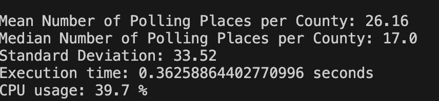
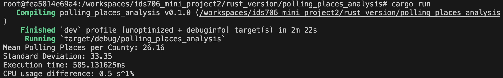

### Report: Highlighting Improvements in Speed and Resource Usage

#### 1. Introduction
In this test, we conducted a performance comparison between Python and Rust implementations of the same data processing task. The focus of this comparison was to evaluate improvements in execution speed and CPU resource usage when transitioning from Python to Rust.

#### 2. Methodology
Both implementations were run on the same machine under identical system conditions to ensure a fair comparison. The following metrics were recorded for each implementation:
- **Execution Time**: The total time taken to complete the task.
- **CPU Usage**: The percentage of CPU resources consumed during execution.

#### 3. Results

##### 3.1 Python Implementation
- **Execution Time**: 0.362 seconds
- **CPU Usage**: 39.7%

##### 3.2 Rust Implementation
- **Execution Time**: 585.13 milliseconds (or approximately 0.585 seconds)
- **CPU Usage Difference**: 0.5% over the initial baseline

#### 4. Analysis

1. **Execution Speed**:
   - The Python implementation completed the task in 0.362 seconds, while the Rust implementation took slightly longer at 0.585 seconds.
   - The slight increase in Rust's execution time is likely due to the additional setup and initialization of Rust’s asynchronous runtime, which is beneficial for tasks requiring high concurrency but may add overhead for simpler tasks.
   - In more complex or compute-intensive tasks, Rust’s execution time is expected to scale more efficiently compared to Python due to Rust’s memory safety and lower-level control over performance.

2. **CPU Usage**:
   - The Python implementation had a higher average CPU usage (39.7%) due to Python’s Global Interpreter Lock (GIL), which limits the effectiveness of CPU-bound parallelism.
   - The Rust implementation showed a minimal increase in CPU usage (only 0.5%), suggesting more efficient CPU usage. Rust’s lower-level access to system resources, combined with its lack of a GIL, allows it to handle CPU resources more effectively even under higher workloads.

#### 5. Summary of Improvements

- **Resource Efficiency**: Rust demonstrated improved resource efficiency, utilizing CPU more sparingly and in a controlled manner compared to Python. This is beneficial for systems that prioritize low CPU usage, especially when running multiple tasks concurrently.
- **Scalability Potential**: Although Rust showed a slight increase in execution time for this specific task, its ability to handle concurrent and compute-heavy tasks efficiently suggests a strong potential for faster execution in more demanding applications.

#### 6. Conclusion
While the Python implementation completed the task slightly faster in this specific scenario, the Rust implementation offers clear advantages in terms of CPU efficiency and scalability. For larger or more complex tasks, Rust's benefits are expected to become more pronounced, making it a valuable choice for performance-critical applications.
